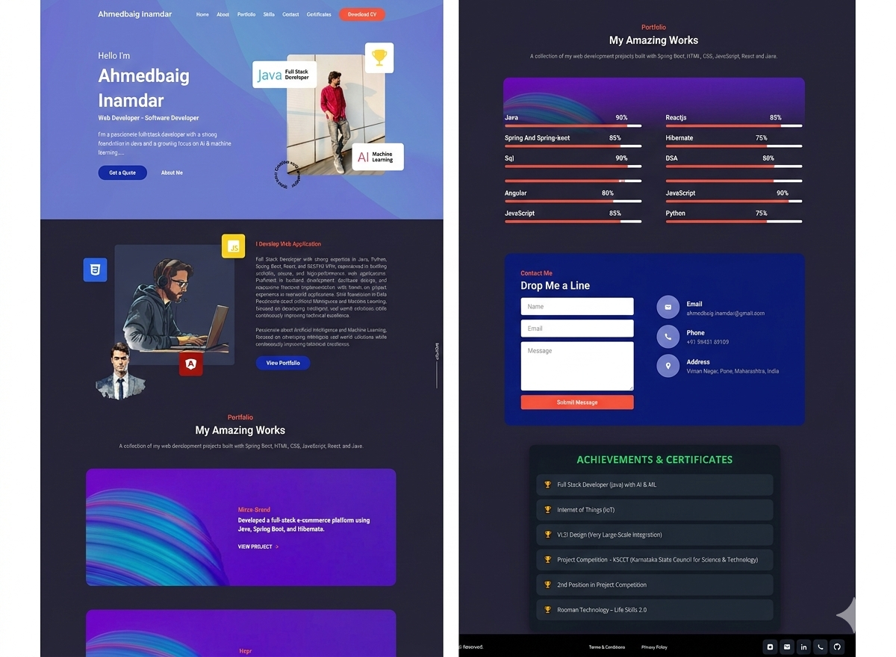

<div align="center">

  
  
  

  <br />
  <br />

  <h2 align="center">Ahmed Baig - Personal Portfolio</h2>

  Fully responsive personal portfolio website, <br />
  built using HTML, CSS, JavaScript and Java (Servlet/JSP).

  <br />

  <a href="https://ahmedbaiginam-stack.github.io/My-portfolio/">
    <strong>➥ Live Demo</strong>
  </a>

</div>

<br />

### Demo Screeshots



### Prerequisites

Before you begin, ensure you have met the following requirements:

* [Git](https://git-scm.com/downloads "Download Git") must be installed on your operating system.

### Run Locally

To run **Portfolio** locally, run this command on your git bash:

Linux and macOS:

```bash
sudo git clone https://ahmedbaiginam-stack.github.io/My-portfolio/
```

Windows:

```bash
git clone https://ahmedbaiginam-stack.github.io/My-portfolio/
```

### Contact

If you want to contact with me you can reach me at [Linkedin](https://www.linkedin.com/in/ahmedbaig-inamdar-678628365).

### License

This project is **free to use** and does not contains any license.
